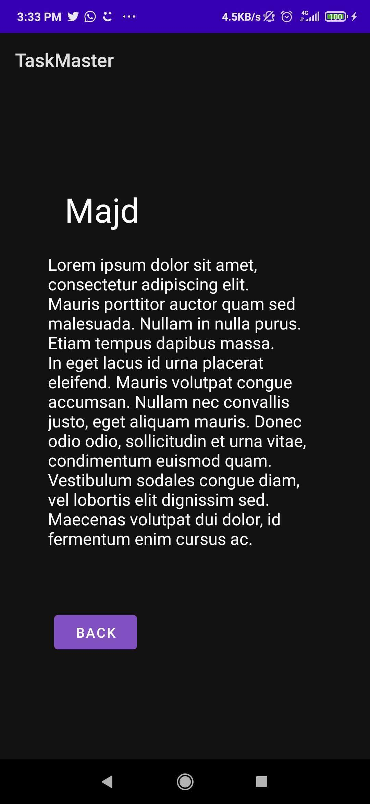

# Task master
# Lab 26
<!-- ## Main Activity (Home Page)

## Add Task Activity

## Add Task Activity (submitted button)

## All Tasks Activity

 -->
- Create Home page contains two buttons to send you to two different pages (activities).
- Add Task page have two fields to take inputs and button that show us submitted when press it.
- All Tasks page have an image with button to take you back to Home Page.

# Lab 27
- Create Home page contain three different buttons and if i press on any button will take me to another page(task details page) and show the button text as a title.
- Create Setting page with field that takes the username from the user and sen it to the home page.

# Lab 28
- Create a Class for the Task to model the data for our tasks then create a ViewAdapter class that displays data from a list of Tasks (hardcoded task)

# Lab 29
- Create DataBase to store the added tasks in it.
- Retrieve the data from DataBase when we want to display it in the RecyclerView
- Add a clickListener to the itemView to send me to the details page and display all information of the task.DataBase

# lab 33

- Edit the schema to generate Team class
- Create 3 Teams (hard coded)
- Create Radio buttons to take the team with the task title and description

# lab 36

- add login/logout system
- display the username for the loggedin user on home page

